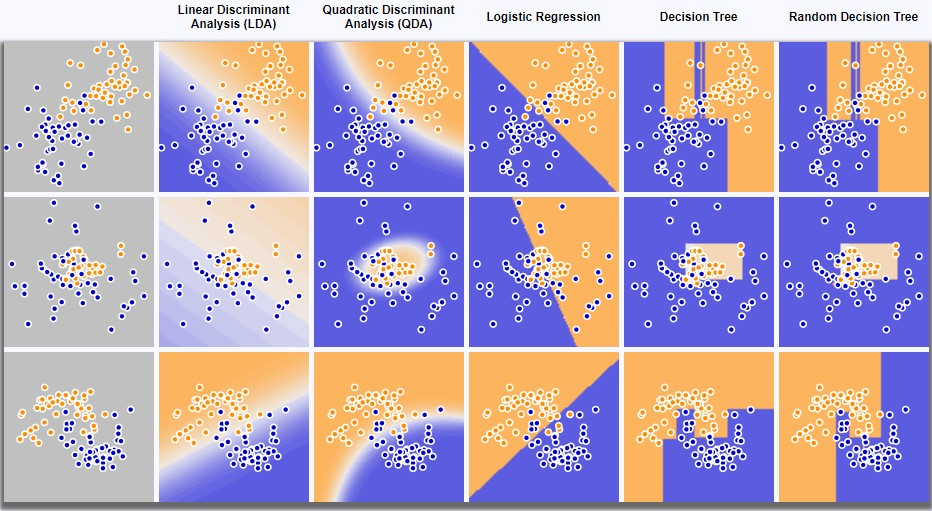

# ml-algorithm-visualizer
A visualizer for some common machine learning algorithms covered in UC Berkeley's CS189: Introduction to Machine Learning course. 

https://jeffjohn3.github.io/ml-algorithm-visualizer/

Here's a preview of the visualizer in action! Check out the page to interact with it live! 

 
